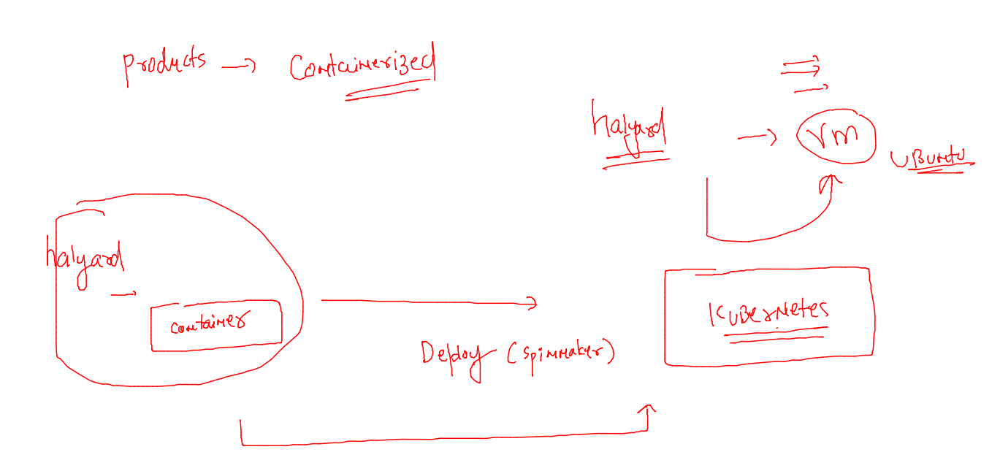
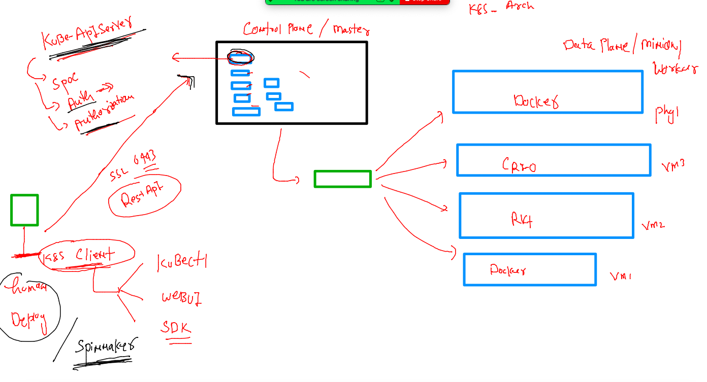

## Training schedule 


## Revision 


## Spinnaker deployment stages


### we can generally install halyard as Container 

```
[ec2-user@client ~]$ docker  images
REPOSITORY                                             TAG       IMAGE ID       CREATED         SIZE
us-docker.pkg.dev/spinnaker-community/docker/halyard   stable    d4bdf593e57a   2 weeks ago     835MB
gcr.io/spinnaker-marketplace/halyard                   stable    f81059ec68f2   17 months ago   737MB
[ec2-user@client ~]$ 
[ec2-user@client ~]$ 
[ec2-user@client ~]$ docker  run -it --rm  d4bdf593e57a   bash 
bash-5.0$ hal -v
1.49.0
bash-5.0$ exit
[ec2-user@client ~]$ docker  run -it --rm   f81059ec68f2  bash 
bash-5.0$ hal -v
1.42.0-20210408182114
bash-5.0$ exit
[ec2-user@client ~]$ 

```

### Halyard in container and spinnaker services in Kubernetes 



## Understanding k8s app deployment 



### lets interact with kubernetes to deploy a sample app 

```
[ec2-user@client ~]$ kubectl  version --client 
Client Version: version.Info{Major:"1", Minor:"23", GitVersion:"v1.23.6", GitCommit:"ad3338546da947756e8a88aa6822e9c11e7eac22", GitTreeState:"clean", BuildDate:"2022-04-14T08:49:13Z", GoVersion:"go1.17.9", Compiler:"gc", Platform:"linux/amd64"}
[ec2-user@client ~]$ 


```

### configure a user to interact with k8s control plane 

```
[spinnaker@client ~]$ mkdir ~/.kube
mkdir: cannot create directory '/home/spinnaker/.kube': File exists
[spinnaker@client ~]$ 
[spinnaker@client ~]$ ls  /home/spinnaker/.kube/
cache
[spinnaker@client ~]$ cp -v /tmp/config  /home/spinnaker/.kube/
'/tmp/config' -> '/home/spinnaker/.kube/config'
[spinnaker@client ~]$ 
[spinnaker@client ~]$ kubectl  get  nodes
NAME            STATUS   ROLES           AGE     VERSION
control-plane   Ready    control-plane   2d11h   v1.25.0
node1           Ready    <none>          2d11h   v1.25.0
node2           Ready    <none>          2d11h   v1.25.0
[spinnaker@client ~]$ 


```

### Resources Understanding in K8s 


