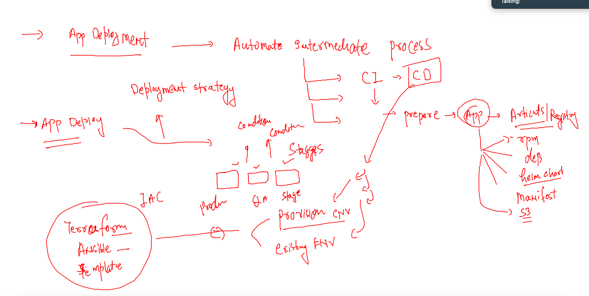
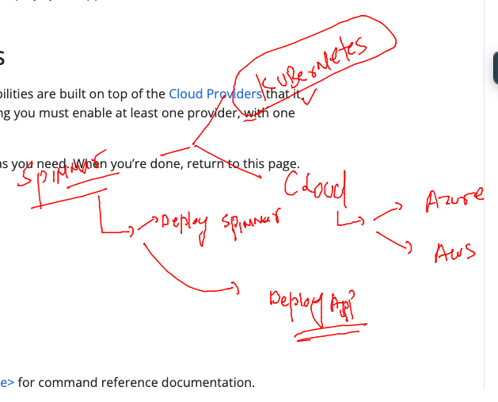
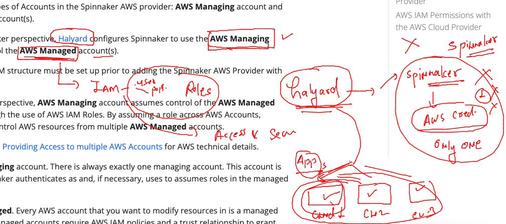

## Training schedule 


### REvision 



### spinnaker using provider for app and component deployment 



### halyard with Aws cloud accounts 




### sPinnaker delete -- create 

```
bash-5.0$ hal -v
1.42.0-20210408182114
bash-5.0$ hal config status
Expected a command, got status
bash-5.0$ hal deploy clean 
This command cannot be undone. Do you want to continue? (y/N) y
+ Get current deployment
  Success
+ Clean Deployment of Spinnaker
  Success
Validation in halconfig:
- WARNING There is a newer version of Halyard available (1.49.0),
  please update when possible
? Run 'sudo apt-get update && sudo apt-get install
  spinnaker-halyard -y' to upgrade

+ Successfully removed Spinnaker.
bash-5.0$ exit

```

## adding aws cloud account to spinnaker for target application deployment 

```
102  hal config provider aws enable 
  103  hal config provider aws account add  spinnaker-aws-account --account-id  88263  --assume-role role/spinnakerManaged  --regions us-east-1, us-west-2 
  104  history 
  105  hal config provider aws edit --access-key-id  RSR6V6K  --secret-access-key  
  106  hal deploy apply 
```
