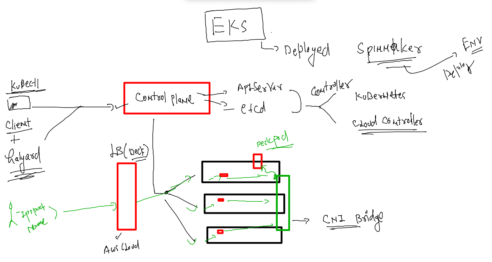
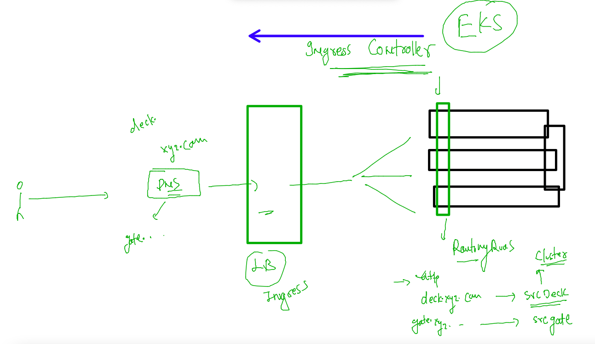
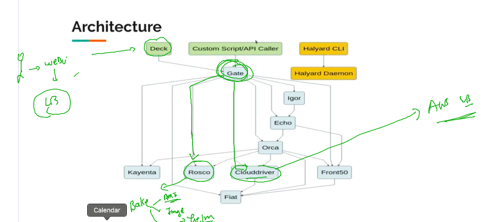
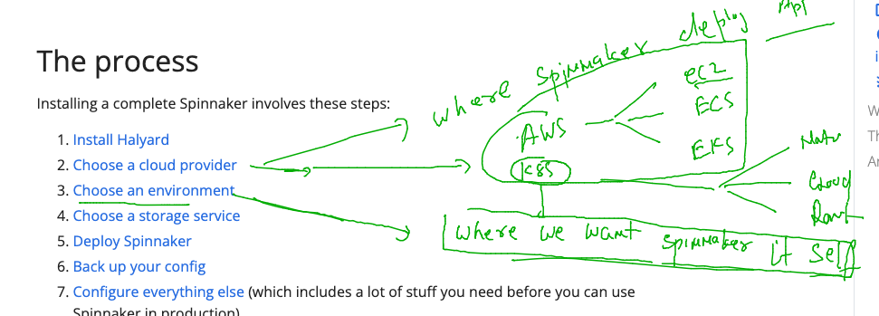
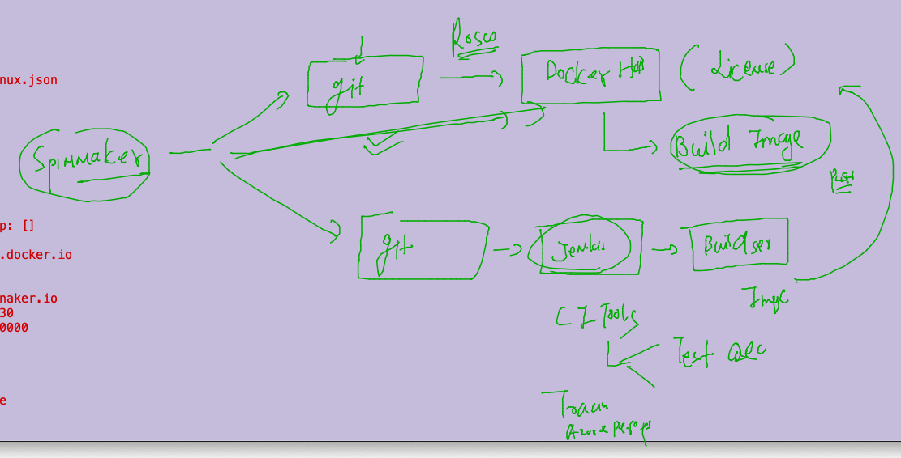

## Training schedule 


## Spinnaker on EKS -- 

### Deck COmponent on EKS 



### avoid multiple LB for internal spinnaker components we can use Ingress controller 



### gate component 



### verify on k8s 

```
[salesforce@spinnaker ~]$ kubectl  get  ns
NAME              STATUS   AGE
ashu-project      Active   3d15h
default           Active   9d
ingress-nginx     Active   3d13h
kube-node-lease   Active   3d20h
kube-public       Active   9d
kube-system       Active   9d
spinnaker         Active   21h
[salesforce@spinnaker ~]$ kubectl  get  deploy  -n spinnaker  
NAME               READY   UP-TO-DATE   AVAILABLE   AGE
spin-clouddriver   1/1     1            1           21h
spin-deck          1/1     1            1           21h
spin-echo          1/1     1            1           21h
spin-front50       1/1     1            1           21h
spin-gate          1/1     1            1           21h
spin-igor          1/1     1            1           132m
spin-orca          1/1     1            1           21h
spin-redis         1/1     1            1           21h
spin-rosco         1/1     1            1           21h
[salesforce@spinnaker ~]$ kubectl  get  svc  -n spinnaker  
NAME               TYPE        CLUSTER-IP       EXTERNAL-IP   PORT(S)          AGE
spin-clouddriver   ClusterIP   10.101.53.124    <none>        7002/TCP         21h
spin-deck          NodePort    10.101.175.70    <none>        9000:31595/TCP   21h
spin-echo          ClusterIP   10.103.87.98     <none>        8089/TCP         21h
spin-front50       ClusterIP   10.105.196.153   <none>        8080/TCP         21h
spin-gate          NodePort    10.97.52.168     <none>        8084:32570/TCP   21h
spin-igor          ClusterIP   10.105.55.223    <none>        8088/TCP         133m
spin-orca          ClusterIP   10.104.160.143   <none>        8083/TCP         21h
spin-redis         ClusterIP   10.96.195.111    <none>        6379/TCP         21h
spin-rosco         ClusterIP   10.107.131.39    <none>        8087/TCP         21h
```

### spinnaker provider env 



### aws -- intergration  managing and managed accounts 


## halyard commands -- for spinnaker --

### checking existing config details 

```
[salesforce@spinnaker ~]$ docker  exec  -it  halyard bash 
bash-5.0$ hal config list 
+ Get all deployment configurations
  Success
+ Retrieved all deployments.
- name: default
  version: 1.26.7
  providers:
    appengine:
      enabled: false

```

### spinnaker with docker & with jenkins and docker hub 




### Deploying eks cluster from spinnaker halyard instances using eksctl 

```
bash-5.0$ eksctl create cluster --name=eks-spinnaker --nodes=2  --region=us-east-1 --write-kubeconfig=false 
2022-09-23 05:08:08 [ℹ]  eksctl version 0.112.0
2022-09-23 05:08:08 [ℹ]  using region us-east-1
2022-09-23 05:08:08 [ℹ]  setting availability zones to [us-east-1a us-east-1c]
2022-09-23 05:08:08 [ℹ]  subnets for us-east-1a - public:192.168.0.0/19 private:192.168.64.0/19
2022-09-23 05:08:08 [ℹ]  subnets for us-east-1c - public:192.168.32.0/19 private:192.168.96.0/19
2022-09-23 05:08:08 [ℹ]  nodegroup "ng-3b8c255e" will use "" [AmazonLinux2/1.22]
2022-09-23 05:08:08 [ℹ]  using Kubernetes version 1.22
2022-09-23 05:08:08 [ℹ]  creating EKS cluster "eks-spinnaker" in "us-east-1" region with
```


