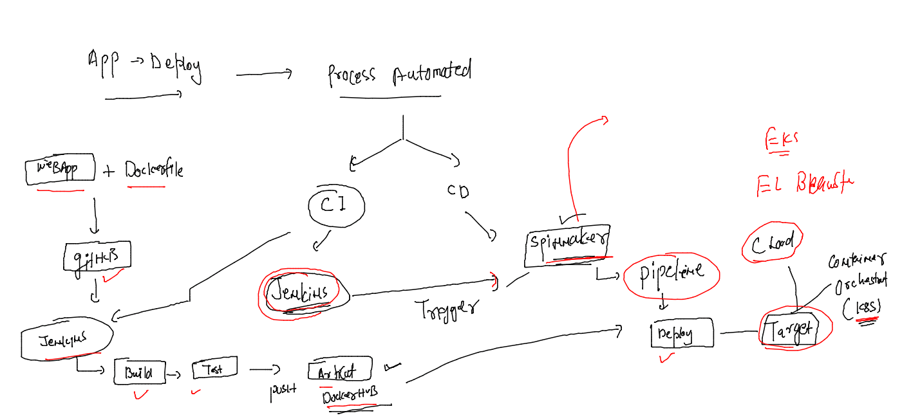
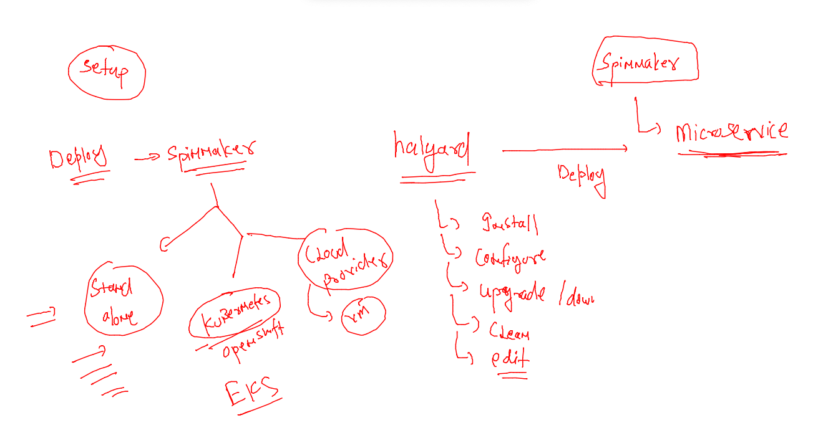

## Training schedule 


## Revision 



## Spinnaker deployment stages



### we can generally install halyard as Container 

```
[ec2-user@client ~]$ docker  images
REPOSITORY                                             TAG       IMAGE ID       CREATED         SIZE
us-docker.pkg.dev/spinnaker-community/docker/halyard   stable    d4bdf593e57a   2 weeks ago     835MB
gcr.io/spinnaker-marketplace/halyard                   stable    f81059ec68f2   17 months ago   737MB
[ec2-user@client ~]$ 
[ec2-user@client ~]$ 
[ec2-user@client ~]$ docker  run -it --rm  d4bdf593e57a   bash 
bash-5.0$ hal -v
1.49.0
bash-5.0$ exit
[ec2-user@client ~]$ docker  run -it --rm   f81059ec68f2  bash 
bash-5.0$ hal -v
1.42.0-20210408182114
bash-5.0$ exit
[ec2-user@client ~]$ 

```


